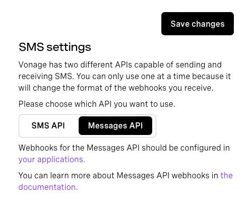

# Session Restoration in NeRu using the Voice and Messages API (V1)

This project shows how to use NeRu sessions to persist context in your application. When you call the number linked to your application, you can leave a message which will be transcribed by the Voice API. Once the call is complete you can text the same number to get your transcript.

## Receive Inbound SMS Webhooks

To receive inbound SMS messages to your NeRu applications you will need to update your API Settings on the Vonage Dashboard to send inbound SMS webhooks to the Messages API:



## Running the project

To run the project after downloading/cloning, first install the dependencies:

```sh
npm install
```

Create a Vonage Application if you do not have one already, and [link a phone number](https://dashboard.nexmo.com) to the application:

```sh
neru app create --name "neru application"  
```

Then initialize NeRu, choosing the `nodejs16` for runtime and `skip` for the template:

```sh
neru init
```

This will create a `neru.yml` file for you. In that file add the linked number under `configurations`:

```yml
project:
    name: $YOUR_PROJECT_NAME
instance:
    name: dev
    runtime: nodejs16
    region: aws.euw1
    application-id: $YOUR_VONAGE_APPLICATION_ID
    entrypoint: [node, index.js]
    capabilities:
        - voice
        - messages-v1
    environment:
        - name: VONAGE_NUMBER
          value: "$YOUR_VONAGE_NUMBER"
debug:
    name: debug
    entrypoint: [nodemon, --inspect, index.js]
```

Then start the project locally using:

```sh
neru debug
```

Now you can call then text number linked to your application.
